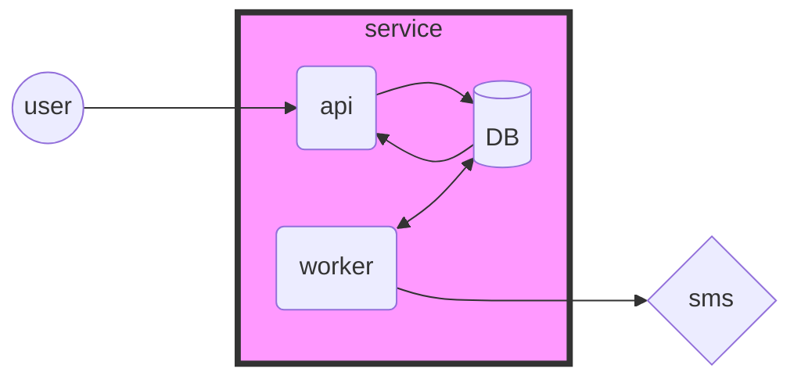
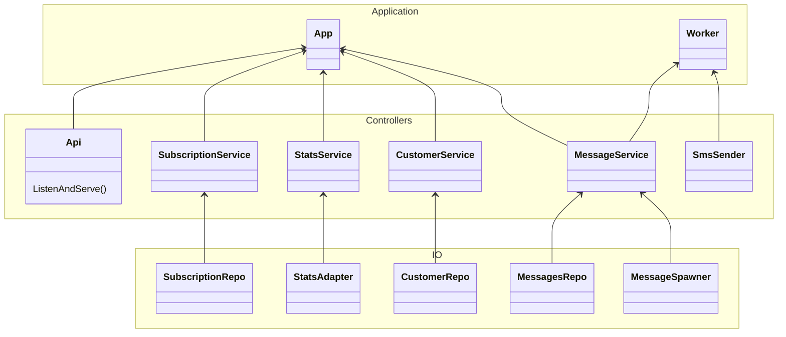

# Сервис уведомлений Notty

[](https://goreportcard.com/report/gitlab.com/thefrol/notty)

Cервис управления рассылками API администрирования и получения статистики.Отправит уведомления с фильтрацией по тегам и операторам. Не пропускает мат. За счет конкурентности готов отправлять по миллиону сообщений в минуту.

Через [веб-апи](./api/openapi.yml) добавляются клиенты и рассылки. У каждой рассылки можно указать время начала и окончания. Если рассылка сейчас активна, то из клиентов отфильтруются те, что подходят по тегам и операторам, и отправит им сообщение.

Сервис [развертывается за 10 сек](#быстрое-развертывание-без-скачивания-репозитория)

Под капотом база данных с двумя микросервисами. Один держит веб-интерфейс, другой проверяет базу и отправляет сообщения. Подробнее [чуть ниже](#описание-сервиса)

Все [допзадания отмечены тут](#допзадания)

Чтобы потестировать [прод-сервер](http://158.160.121.21/), можно воспользоваться [тестовыми запросами](./test/prod.http)

## Развертывание

Можно воспользоваться компоновщиком докера в [быстром деплое](./deploy/fast-compose/) или [когда репозиторий скачан](./deploy/docker-compose.yml)

При любом деплое можно сразу воспользоваться [пользовательским сценариаем](./test/sample.http), чтобы опробовать деплой. Там будет созданы получатели , будет создана рассылка. И сообщение тут же уйдет пользователю, но только одному

### Быстрое развертывание без скачивания репозитория

Чтобы запустить сервис за десять секунд, достаточно старого советского...

#### Шаг 1. Установка токена

```bash
export TOKEN=<вставь_токен_сюда> # ваш токен
```

#### Шаг 2. Запуск

```bash
# скачаем компоуз
curl https://gitlab.com/api/v4/projects/52099976/repository/files/deploy%2Ffast-compose%2Fdocker-compose.yml/raw?ref=main > docker-compose.yml

#запустим
docker-compose up
```

> если для докера требуются привилегии, стоит использовать `sudo -E`

#### Шаг 3. Успех

Сразу можно покопаться в [сваггер-интерфейсе](http://localhost/docs). Возпользуйтесь [подборкой запросов](./test/sample.http), чтобы сразу отправить первое сообщение.

### Если репозиторий скачан

То достаточно запустить скрипт:

```bash
TOKEN=<your_token> ./scripts/run-local
```

### В кубернететес

Так же легко соскальзывает в кубернетес

```bash
kubectl apply -f ./deploy/k8s
```

## Задание

Полную версию задания можно найти [тут](./tech-task.md)

## Описание сервиса

Go:

+ моки с `minimock`
+ постгрес с `pgx` и `sql`
+ миграции с `goose`
+ докер для запуска инфраструктуры
+ интегральные тесты по репозиториям с постгрёй
+ быстрая серилизация `easyjson`
+ `chi` и `resty` для http

Инфра:

+ постгрес
+ сваггер
+ докер
+ кубернетес

### Архитектура

Если взять все компоненты, то выглядит это вот так. По сути у нас есть два независимых компонента, которые взаимодествуют через базу данных



Код сделан в слоеной манере, близкой к DDD, где более низкоуровневые классы зависят от высокоуровневых



Архитектура отталкивается от безопасности данных в потоке. Основная задача состояло в том, чтобы не дай бог не отправить два одинаковых сообщения. Лучше иногда не отправить сообщение, чем выбесить клиентов кучей сообщений. Поэтому я обезопасил работу со многими экземпларами.

Сервер изначально замуман менеджером. Там можно делать `CRUD` операции с рассылками и подписчиками. И никакой бизнес логики. Это осознанное решение: интерфейс все-таки штука подвижная довольно и он будет обновляться. А значит будет деплоится. И если мы хотим бесперебойную работу, то сразу надо подумать о том, чтобы сервер мог работать в двух инстансах - в момент развертывания.

Узкое место в потокобезопасности это создание сообщений. Поэтому из фасада убрано все, что отвечает за создание сообщений. Таким образм мы можем плодить сколько угодно инстансов с `api`.

За создание сообщений отвечает `воркер`. А его мы можем безболезненно остановить на пару минут и ничего не случится. Вне зависимости от того, как быстро будет изменяться воркер, мы сможем его остановить.

Сейчас воркер работает без блокировки. Это **первый этап**. Подразумевается, что никто другой не может вклиниться или работать параллельно с ним, поэтому никаких блокировок не используется. Но понятно, что сообщений может быть очень много и мы должны уметь отправлять огромную кучу сообщений. Значит отправщики должны уметь взаимодействовать между инстансами.

Во **втором этапе** могут работать множество инстансов отправщиков, причем каждый отпращик умеем и создавать сообщения и отправлять их. При этом не пересекаясь с другими отправщиками. Это будет реализовано при помощи блокировки таблицы с сообщениями. Каждый процесс заходит в базу, создает себе 50-100-1000 сообщений и освобождает базу. Следузий воркер уже создаст себе других сообщений. Таким образом для работы такой системы нам понадобится два компонента: фасад и воркер.

В **третьем этапе** будет выделен отдельный мастер сервер, который создает сообщения. Или некий сервер, который будет работать вроде мьютекса и пропускать процессы к базе. Более очевидный вариант, чтобы он сам делился сообщениями с воркерами. Таким образом у нас будет три элемента: фасад, почтовый офис и почтальоны.

В **четвертом этапе** сизронизацию работы почтальонов передадим специализированному сервису, например `Kafka`. Почтовый сервер будет спавнить в него сообщения, а брокер позаботиться, чтобы они не потерялись и не перепутались. Воркеры будут просто читать кафу и отправлять. Количество воркеров может регулировать кластер в зависимости от наполненности кафки. Тут у нас уже четыре компонента: фасад, почтовый офис, брокер кафка и отправщики.

Таким образом в конце мы получаем невероятно масштабный сервис в конечной точке, не потратив лишнее время на разработку `MVP` в самом начале.

### АПИ сервер

+ Мигрирует в базу сам, базу нужно указать
+ Запускается на порту `8080`
+ По маршруту `/docs` покажет сваггер
+ Очень быстрый, запросы на вытягивание **2-3 мс**

Конфигурируется переменными окружения:

+ `NOTTY_DSN` - строка подключения к постгре

Есть скрипт, чтобы [быстро запустить базу](#запустить-локальный-докер-с-базой), см. раздел разработка

### Статистика

Сообщения имеют несколько статусов:

+ `created` - только что создано и скоро будет отправлено
+ `done` - успешно отправлено
+ `failed` - не отправлено, но будет повторная попытка
+ `invalid` - такое сообщение не отправлено, и не будет. По сути, это означает что внешний апи при отправке выдал код ошибки `400 bad request`

При обращении к ручкам статистики можно получить количество сообщений в каждом из статусов. Можно посмотреть статистику общую, по подпискам, и по клиентам. Дальшейшем можно будет фильтровать по тегам и по датам - с такой-то по такую-то дату.

> Сообщения, которые ещё не были сформированы в статистике не участвуют. То есть, если рассылка начнет работать завтра, то мы не сможем посмотреть сколько сообщений уже создано. Потому что они ещё не созданы.

Корневая ручка по статистике это `/stats/`. Если обратиться прямо к ней, то получим общую статистику, по всем всем сообщениям. Есть ещё несколько ручек для получения статистики по сущностям:

+ `GET /stats/customer/{id}` или `GET /customer/{id}/stats` статистика по пользователю
+ `GET /stats/subscription/{id}` или `GET /subscription/{id}/stats` статистика по рассылке

Пример ответа:

```json
{
    "done":42412,
    "failed":45,
    "invalid":1
}
```

## Допзадания

+ Сваггер по маршруту `/docs/`. Все коды подписаны, все примерчики красивые подходящие под коды ошибок. Все ручки и тери подписаны. Ляпота.
+ Юнит тестирование, и ***интегральное тестирование** в пайплайне на гитлабе
+ Сделан [Dockerfile](./Dockerfile)
+ При коммите в мейн автоматически собирает контейнеры и отправляет в [реестр](https://gitlab.com/thefrol/notty/container_registry/)
+ Автоматически обновляет [прод сервер](http://158.160.121.21/docs) по коммиту в мейн
+ Сделан [docker-compose.yml](./deploy/docker-compose.yml)
+ Проработать недоступность сервиса отправки смс. Два варианта: если сервер вернул `Bad Request(400)`, то сообщение помечается как `отказное`, и выбывает из списка на отправку. В иных случаях оно помечается как проваленное и потом будет ещё раз отправлено.

### Сваггер интерфейс

Доступен по адресу `/docs/`

### Тестирование на Гитлабе

Локально можно запустить командой `go run ./...`, а ещё ...

#### Интегральное тестирования хранилищ

Находится в `.gitlab-ci.yml` вот тут

```yaml
repository_test:
  stage: test
  services:
    - name: postgres
      alias: test_db
  script:
    - export NOTTY_TEST_DB="host=test_db  dbname=test user=test password=test sslmode=disable"
    - export NOTTY_TEST_NOSKIP=1
    - go test -v ./test/...
```

## Что мне удалось

+ Валидация запросов - в том числе на мат
+ Конкуретная отправка сообщений одновременно с поиском сообщений к отправке
+ хорошая семантика, например `valid.If(valid.PhoneNumber(c.Phone), valid.Id(c.Id))`
+ скорость
+ `CI`, тесты в гитлабе вообще сказка. Я честно не знал, что гитлаб так хорош
+ Тулинг: запуск бд, очистка и наполенния тестовыми данными в `./tool/` и скриптах

## Что не удалось

+ `App` - этот класс должен содержать высокоуровневую логику, например, как именно обновляются подписки итд. Но там ничего нет. По сути особо ничего высокоуровневого у меня нет, но и как факт, все забито в хендлеры
+ Сущность рассылки называется `Subscription`, тогда как её суть полностью противоположна
+ Логгирование
+ ДДД. Высокие уровки взаимодействуют с нижними без интерфейсов, перескоки через слои немношт. Это все печально
+ Во всех деплойментах у меня нет постоянных хранилищ
+ Забыл часовой пояс у клиента

## Разработка

### Запустить локальный докер с базой

```bash
./scripts/start-postgres
```

ПОсле успешного запуска скрипт выведет строку для подключения

```bash
База данных для нотти доступна по такой строке:
host=localhost dbname=notty_dev_local user=notty_dev_local password=local.dev.1 port=15432 sslmode=disable
```

И далее можно создать `launch.json` с такой вот конфигой

```json
{
    // Use IntelliSense to learn about possible attributes.
    // Hover to view descriptions of existing attributes.
    // For more information, visit: https://go.microsoft.com/fwlink/?linkid=830387
    "version": "0.2.0",
    "configurations": [
        {
            "name": "Апи сервер",
            "type": "go",
            "request": "launch",
            "mode": "auto",
            "program": "./cmd/server",
            "env":{
                "NOTTY_DSN":"host=localhost dbname=notty_dev_local user=notty_dev_local password=local.dev.1 port=15432 sslmode=disable"
            }
        }
    ]
}
```

## Тайминги

+ 1,5 часа Написать опенапи спеку и сгенерировать сервер
+ 1,5-3 час репозитории и подключение бд
+ 3-4 час хендлеры
+ 4-7 час отправщик и новые сервисы
+ 7-8 час синхронизация с ендпоинтом
+ ... бесконечный рефакторинг после этого безумно быстрого безумного писания
